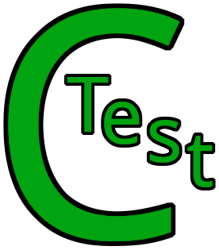

# CTest -- The x86_64 Linux C testing framework
===

**Note**: This is currently a work in progress

# License

CTest is licensed under the GNU AGPL version 3. See [LICENSE.md](./LICENSE.md) for more informations
